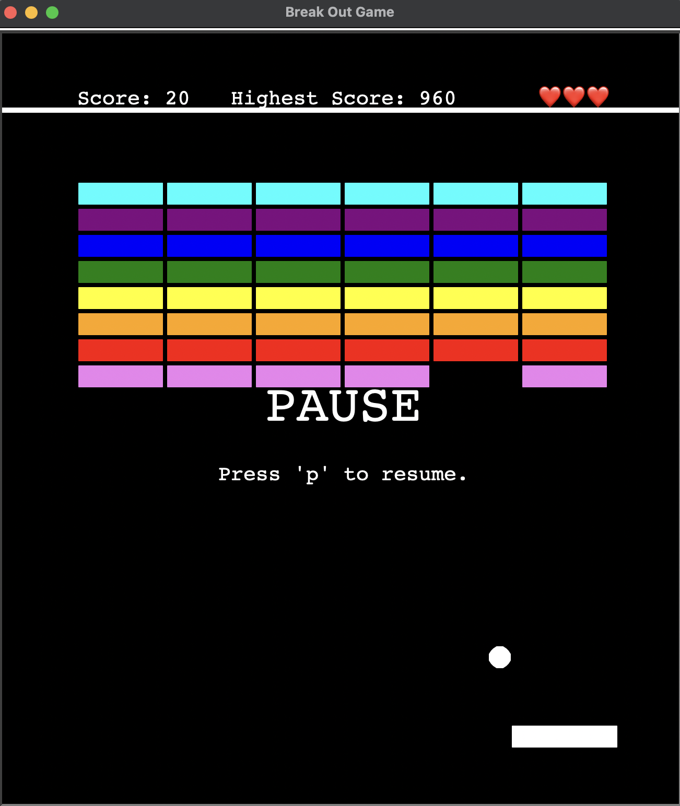

# Breakout Game

A classic Breakout game implemented in Python using the Turtle graphics library. Breakout is a simple yet addictive arcade game where you control a paddle to bounce a ball and break bricks.



## Reproducible Code Steps

To run the Breakout Game on your local machine, follow these steps:

1. **Clone the Repository**: Clone the Breakout Game repository to your local machine:

    ```bash
    git clone https://github.com/dieegogutierrez/BreakOutGame.git
    ```

2. **Navigate to the Project Directory**: Change your current directory to the root of the cloned repository:

    ```bash
    cd BreakOutGame
    ```

3. **Install Python Dependencies**: Make sure you have Python installed on your machine. Then, install the required dependencies using pip:

    ```bash
    python3.9 -m venv venv
    source venv/bin/activate
    pip install -r requirements.txt
    ```

4. **Run the Game**: Execute the main Python script to launch the Breakout Game:

    ```bash
    python main.py
    ```

5. **Play the Game**: Once the game starts, follow the instructions below on how to play the Breakout Game.

## Features

- Classic Breakout gameplay with bricks, paddle, and ball.
- Scoreboard to keep track of your score, high score and lives.
- Pause and resume the game.
- High score saved to 'highscore.txt'.

## How to Play

- Press **'Return'** to start the game.
- Use the **Left** and **Right** arrow keys to move the paddle.
- Press **'p'** to pause and resume the game.
- Press **'Space'** to restart the game after game over.
